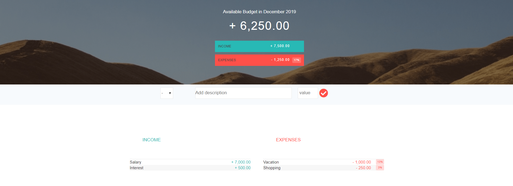

# Budget

## Demo: [Budget](https://anish732.github.io/Budget/)

### Budget App is to calculate monthly budget. You can enter all your income and expenses. It will give you available balance. Budget App will calculate percentage of your each expense and also total expenses.

## Screenshot:



## Code:

This code format numbers. It convert from 20000 to 20,000.00

```
  var formatNumber = function(num, type) {
  var type,numSplit, int;

  num = Math.abs(num);
  num = num.toFixed(2);

   numSplit = num.split(".");
   int = numSplit[0];

  if (int.length > 3) {
    int = int.substr(0, int.length - 3) + "," + int.substr(int.length - 3, 3); //if input is 2310, output 2,310
  }

```

## Technologies :

<ul>

<li> HTML
<li> CSS
<li> JavaScript

</ul>
